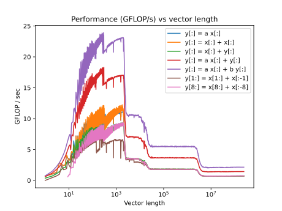
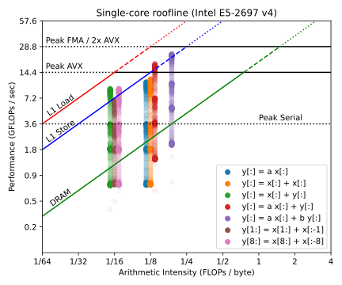

========
Optiflop
========

A tool for measuring peak performance and roofline analysis.

About Optiflop
==============

Optiflop is a program for measuring the peak computational performance
(in FLOPs per second) and memory bandwidth on a compute node.  Tests are
written in C with a goal of portability.

Quick usage guide
=================

This is still a development branch, so the build process requires an extra step
or two.

1. Generate the ``configure`` script and ``Makefile``, then ``make``.::

      $ autoreconf
      $ ./configure
      $ make

To run for a default vector size (3200)::

   ./optiflop

For further options, ``optiflop --help``.
