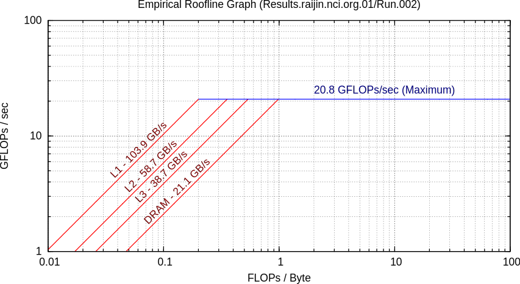

==========
microbench
==========

Floating point microbenchmarks for Raijin

Motivation
==========

The purpose of these microbenchmarks is to provide the baseline parameters for
a `roofline performance model`_.  Roofline models relate model performance,
typically FLOPs per second, to the memory bandwidth required for the
calculation, or the *arithmetic intensity*.  The arithmetic intensity is
typically defined as number of FLOPS that can be performed per bytes
transferred from memory (usually DRAM).

An example roofline diagram for a single CPU core on Raijin, as produced by the
`Empirical Roofline Toolkit`_, is shown in the figure below.

   An example roofline diagram for one of Raijin's CPUs.

The figure illustrates the peak FLOP performance as a function of arithmetic
intensity.  Tasks which require many calculations over a limited data set, such
as DFTs or dense matrix solvers, will have a high arithmetic intensity and be
bounded by the computational speed of the CPU, denoted by the solid horizontal
line.  Simpler calculations, such as simple Euler timesteps across a vector, or
pointwise PDE approximations on compact stencils, will have much lower
arithmetic intensity and may be bounded by memory transfers, such that the CPU
is waiting on new data to calculate.  Memory-bounded peak performance limits
are denoted by the sloped curves on the left for different CPU cache levels and
on-board DRAM.

Arithmetic Intensity
--------------------

A hierarchy of calculations based on arithmetic intensity are shown below.

Register arithmetic
+++++++++++++++++++

Operations which are applied directly to registers do not require any data
transfers and represent the peak performance for any operation.  An example
using x86 AVX instructions is shown below.

.. code:: c

   __mm256 r0, r1                   /* 32-byte vector of 8 SP floats */

   r0 = _mm256_set1_ps(1.0f)        /* r0[:] = 1.0f */
   r1 = _mm256_set1_ps(2.0f)        /* r1[:] = 2.0f */

   for (int i = 0; i < N; i++)
       r0 = _mm256_add_ps(r0, r1)    /* r0[:] = r0[:] + r1[:] */

Since the arithmetic is performed directly on registers, there is no transfer
of memory from cache, and the arithmetic intensity can be interpreted as
infinite.  The peak performance would therefore bounded by the peak theoretical
performance of the CPU.

(Note that the above example would not achieve peak performance, since the
latency of the arithmetic operation (``vaddps``) exceeds 1 cycle, and requires
some additional pipelining to improve its performance.  This is discussed
futher in a later section (TODO: section name)).

It is rare to find practical examples of register arithmetic which do not
depend on DRAM or cache memory, since operations will typically depend on more
values than available registers, even if only indirectly.  Otherwise, the
repetitive arithmetic could be reduced to a single operation.

Vector arithmetic
+++++++++++++++++

Vectorised addition is the simplest example of a potentially memory-bound
operation, such as in the code block shown below.

.. code:: c

   float x[N], y[N];

   for (int i = 0; i < N; i++)
       y[i] = x[i] + y[i];

To compute the arithmetic intensity of this loop at the L1 cache level:

1. Two 4-byte reals must be loaded from L1 to register, or 8 bytes.

2. One floating point calculation is computed using these two bytes.

So the arithmetic intensity is (1 FLOP / 8 bytes) or 0.125.

Measurement
-----------

Construction of a roofline diagram involves two steps of measurement.

1. Global performance bounds of the current hardware platform, and

2. Measurement of the performance (FLOP/sec) and arithmetic intensity
   (FLOP/byte) of a program or code segment.

Timing
++++++

Execution time is required to compute the FLOPs-per-second performance of a
function or code block.  We will typically obtain this number from a profiler
such as Score-P, but some lower level options are considered below.

``clock_gettime``
~~~~~~~~~~~~~~~~~

This is the most standard method for getting the current time in a POSIX
environment, and is the default method used by Score-P.  The header is stored
in ``time.h`` and the time is stored in a ``timespec`` object.  Different
clock types are available, each with different dependencies on the kernel's
system clock and the CPU's time stamp counter.

The ``timespec`` struct offers nanosecond precision, separated into two fields:

.. code:: c

   struct timespec {
       time_t tv_sec;      /* seconds */
       long tv_nsec;       /* nanoseconds */
   };

A ``clock_gettime`` example using the ``CLOCK_REALTIME`` clock is shown below.

.. code:: c

   #include <time.h>
   #include <stdio.h>

   int main() {
      struct timespec ts_time;
      clock_gettime(CLOCK_REALTIME, &ts_time);
      printf("Seconds since epoch: %f\n",
             (double) ts_time.tv_sec + (double) ts_time.tv_nsec / 1e9);
      return 0;
   }

The following clocks are available on Raijin:

``CLOCK_REALTIME``
   This uses the system clock and reports seconds since the Epoch (1 Jan 1970).
   It is sensitive to NTP as well as system changes, and can decrease in time.

``CLOCK_MONOTONIC``
   This measures monotonic time increases relative to an arbitrary starting
   point, such as system bootup time.  It is not affected by explicit time
   adjustment steps (``settimeofday()``) but can be modified by time slewing
   (gradual frequency adjustments by ``adjtime()``).

``CLOCK_MONOTONIC_RAW``
   This also measures monotonic time, but is unaffected by both steps and
   slews.  This has the closest correlation to CPU cycles, and is the preferred
   clock for profiling.

``CLOCK_PROCESS_CPUTIME_ID``
   High-resolution per-process and per-thread clocks.  I have not tested these
   clocks yet and cannot comment on their usefulness.

``CLOCK_THREAD_CPUTIME_ID``
   A per-thread clock that I have also not yet tested.

``clock_gettime`` accesses the time by reading a kernel-space memory via VDSO,
so there is no context switching cost.  The values in memory are updated
periodically by the kernel.  My reading suggests that they are triggered by
timing interrupts and rely on the ``rdtsc`` assembly instruction, with some
interpolation used to infer the elapsed nanoseconds, but more information is
needed here.

``clock_gettime`` is generally very accurate, despite some small overhead, and
is easy to use, so is generally the preferred choice for timing measurements.

``rdtsc``
~~~~~~~~~

The ``rdtsc`` assembly instruction provides direct access to the CPU's Time
Stamp Counter (TSC).  The TSC counts the number of effective cycles since
powerup based on a nominal frequency.  This cycle count is not a direct measure
of the actual number of cycles; the TSC is increased by the equivalent number
of cycles at a prescribed frequency over each time interval.

For example, if the CPU frequency is doubled, then the TSC will record two
actual cycles as a single (slower) TSC cycle, so that the TSC counter reports
half of the actual cycles.  In this sense, the TSC is a measure of time, rather
than cycles, although it requires us to know the TSC frequency in order to
convert the number into a time.

The TSC is a 64-bit register and the ``rdtsc`` instruction transfers the high
and low bits to the EDX and EAX registers, respectively.  On 64-bit platforms
such as Raijin, the RDX and RAX registers are used, with the upper 32 bits of
each set to zero.

The following code will read the ``rdtsc`` register into memory:

.. code:: c

   uint64_t lo, hi, tsc;

   __asm__ __volatile__ ("rdtsc" : "=a" (lo), "=d" (hi))
   tsc = (hi << 32) | lo;

This code calls the ``rdtsc`` instruction and saves ``%rax`` and ``%rdx`` to
their respective registers, followed by a conversion to the full 64-bit value.
(These issues are addressed in the Intel white paper, `How to Benchmark Code
Execution Times on Intel® IA-32 and IA-64 Instruction Set Architectures`_.

In order to safely use the TSC register, several issues must be considered:

1. Register volatility

   When calling the assembly instructions, one should explicitly mark the EAX
   and EDX registers as volatile, so that any previous instructions will not be
   contaminated.  This is done with the optional third ``asm`` argument:

   .. code:: c

      __asm__ __volatile__ ("rdtsc" : "=a" (lo), "=d" (hi) :: "%rax", "%rdx");

   This will prevent spurious segmentation faults during testing.

2. Out-of-order execution

   Intel CPUs will cache and reorder its assembly instructions in order to
   minimise latency effects, regardless of the order in the executable, and
   this can lead to scenarios where ``rdtsc`` is called prematurely or after a
   code block has begun.  This can be prevented by using serialising
   instructions.

   One option is to use the ``cpuid`` instruction, which populates the EAX,
   EBX, ECX, and EDX instructions with information about the CPU.  Since this
   instruction is seralized, it ensures that all instructions prior to it have
   been completed.  However, the latency of this instruction can be volatile
   and it is best to only use this before a dedicated ``rdtsc`` instruction.

   Another alternative is to use the ``rdtscp`` instruction, which combines the
   ``cpuid`` and ``rdtsc`` instructions and is also serialized.  Since it is
   still longer than ``rdtsc``, it is best to use this at the end of a profiled
   code block.

   It is also a good idea to follow ``rdtscp`` with another ``cpuid`` call, in
   order to ensure no instructions are inserted before the ``rdtscp`` call.

   An example code block which avoid serialization is shown below:

   .. code:: c

      __asm__ __volatile__ (
         "cpuid\n"
         "rdtsc"
         : "=a" (rax1), "=d" (rdx1) :: "%rax", "%rbx", "%rcx", "%rdx");

      /* Code block */

      __asm__ __volatile__ (
         "rdtscp\n"
         "movq %%rax, %0\n"
         "movq %%rdx, %1\n"
         "cpuid"
         : "=r" (rax2), "=r" (rdx2) :: "%rax", "%rbx", "%rcx", "%rdx");

3. Warmup (populate the instruction cache)

   .. TODO

4. Kernel improvements

   While not an option for userspace profiling, it is possible to implement a
   code block as a kernel model and make additional improvements which prevent
   interference by the kernel.

   a. ``preempt_disable()``, ``preempt_enable()``
   b. ``raw_local_irq_save()``, ``raw_local_irq_restore()``

5. User overhead

   1. Explicit ``movq`` calls?

   2. Calculate times later!

getrusage
~~~~~~~~~

TODO

Other methods
~~~~~~~~~~~~~

Some others:

1. ``gettimeofday``

2. ``time``

flop
====

.. References

.. _`roofline performance model`:
   http://crd.lbl.gov/departments/computer-science/PAR/research/roofline

.. _`Empirical Roofline Toolkit`:
   https://bitbucket.org/berkeleylab/cs-roofline-toolkit

.. _`How to Benchmark Code Execution Times on Intel® IA-32 and IA-64 Instruction Set Architectures`:
   http://www.intel.com/content/www/us/en/embedded/training/ia-32-ia-64-benchmark-code-execution-paper.html
