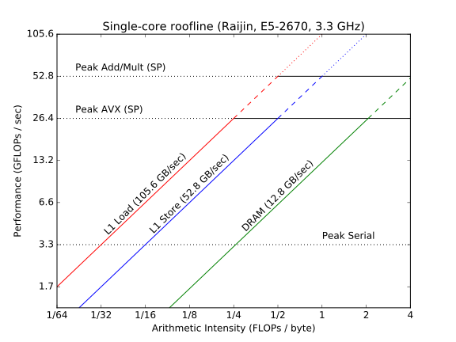

===================
Roofline benchmarks
===================

:author: Marshall Ward
:organization: National Computational Infrastructure
:contact: marshall.ward@anu.edu.au
:status: Draft (incomplete)
:date: 30 September 2016

.. contents::

Roofline profiling
==================

*Note: This documentation was part of an internal study at NCI, and refers to
an earlier version of Optiflop.*

Introduction
------------

A `roofline performance model`_ is a method developed by researchers at
Lawrence Berkeley National Labs to visualise the relationship between
computational performance, typically as FLOPs per second, and the memory
bandwidth required for the calculation.  This is characteristed by defining an
*arithmetic intensity*, which is defined as number of FLOPs that can be
computer per bytes transferred to or from memory.

An example roofline diagram for a single CPU core on Raijin is shown in Figure
1.

   Single-core roofline diagram for a Sandy Bridge CPU core on Raijin.

The figure illustrates the peak FLOP performance as a function of arithmetic
intensity.  The horizontal lines denote the peak performance of a single core
based on continuously pipelined calculations.  Non-vectorised serial
calculations, single precision AVX operations, and concurrent add/multiply AVX
operations are shown in the figure.  The sloped lines denote the peak memory
transfer rates for a given arithmetic intensity.  Transfer rates for L1 loads
(32 bytes / cycle), L1 stores (16 bytes / cycle), and single-channel DRAM
transfers (800 MHz DDR, 64-bit bus) are shown here.  Additional curves can be
added to this figure, such as peak double precision arithmetic performance,
transfer rates for L2 and L3 caches, or Infiniband bandwidth.  However, as a
first introduction to roofline modelling, we will omit these processes for now,
and hope to incorporate them into future analyses.

In order to use a roofline model, one must first determine the arithmetic
intensity of a particular code block, which is a platform-agnostic parameter,
and then measures the runtime performance.  By placing the data point on the
roofline diagram, one can assess the performance relative to peak performance,
and in many cases can quickly identify if a calculation is either memory-bound
or compute-bound.

.. TODO Example cases here

Tasks which require many calculations over a limited data set, such as discrete
Fourier transforms or dense matrix solvers, have a high arithmetic
intensity and will typically be bounded by the computational speed of the CPU.
Simpler calculations, such as Euler timesteps applied over some vector, or
pointwise PDE approximations over compact stencils, will have much lower
arithmetic intensity and may be bounded by memory transfers where the CPU is
waiting on new data to calculate.

In this section, we first review the peak performance on Raijin, including the
impact of turbo boost and concurrent add/multiply calculations.  We then relate
peak performance to arithmetic intensity, and calculate the minimum arithmetic
intensity required to achieve peak performance.  This is followed by a review
of timing measurements using ``clock_gettime`` and the ``rdtsc`` assembly
instruction.  Finally, we present results for the performance on various vector
operations by relating the theoretical performance based on roofline analysis
to the observed performance.

Peak performance
----------------

We first review the peak floating point performance of the processors on
Raijin, in order to provide a reference point for our roofline analysis tests.

The peak performance of the CPU is

.. math::

   P_\text{peak} = f \times N_\text{ops} \times N_\text{vec}

where :math:`f` is the maximum CPU frequency, :math:`N_\text{ops}` is the
maximum number of concurrent operations per cycle, and :math:`N_\text{vec}` is
the size of the vector registers.

For the Sandy Bridge architecture used on Raijin, the maximum turbo-boosted
frequency is a function of the number of active cores, and obeys the following
formula:

.. math::

   f = 2601 \ \text{MHz} + \left(4 + \left\lfloor \frac{8 - n}{2} \right\rfloor
   \right) \times 100 \ \text{MHz}

so that :math:`f` is equal to 3.3 GHz when one core is active, and 3.0 GHz when
all 8 cores are active.  The non-turbo (TSC) frequency is 2.601 GHz.

The Sandy Bridge architecture supports the AVX instruction set, which supports
arithmetic over packed 256-bit (32-byte) registers.  For 4-byte
single-precision floating point numbers, we can compute 8 simultaneous values,
so that :math:`N_\text{vec} = 8`.

The Sandy Bridge scheduler contains six independent ports for simultaneous
operations, including independent ports for addition and multiplication.  Under
optimal conditions, the Sandy Bridge is capable of concurrent AVX addition and
multiplication, enabling it compute two vectorised floating point operations
(FLOPS) over an AVX register per cycle, so that the peak value of
:math:`N_\text{ops}` is two.

The peak performance, in GFLOPS per second, on Raijin is summarised on the
following table:

=====    ======   ======   ======   ======   ======   ======
Cores    SP Add   SP Mul   SP MAC   DP Add   DP Mul   DP MAC
=====    ======   ======   ======   ======   ======   ======
1-2        26.4     26.4     52.8     13.2     13.2     26.4
3-4        25.6     25.6     51.2     12.8     12.8     25.6
5-6        24.8     24.8     49.6     12.4     12.4     24.8
7-8        24.0     24.0     48.0     12.0     12.0     24.0
TSC        20.8     20.8     41.6     10.4     10.4     20.8
=====    ======   ======   ======   ======   ======   ======

- *SP*:  Single-precision
- *DP*:  Double-precision
- *Add*: Addition
- *Mul*: Multiplication
- *MAC*: Concurrent addition-multiplication
- *TSC*: Time Stamp Counter, referring to the non-turbo TSC frequency

.. TODO Haswell 12-core peak flops

Memory (RAM) Bandwidth
++++++++++++++++++++++

Raijin nodes use DDR3-1600 RAM.  Peak memory performance is

.. math::

   B_\text{peak} = f_\text{mem} \times N_\text{DDR} \times N_\text{bus}
                     \times N_\text{channels}

The physical clock speed is 800 MHz, and DDR performs two sends per cycle.  The
bus width is 64 bits, and we can use up for 4 channels at once (although not
necessarily all to the same CPU).

The maximum burst rate (using all channels) is

.. math::

   B_\text{peak} &= 800 \ \text{MHz} \times 2 \times 8 \ \text{bytes} \times 4 \\
                 &= 51.2 \ \text{GB/sec} (409 \ \text{Gb/sec}) \\
                 &= ~47.7 \ \text{GiB/sec} (~381 \ \text{Gib/sec})

The single-chanel transfer rate is

.. math::

   B_\text{peak} &= 800 \ \text{MHz} \times 2 \times 8 \ \text{bytes} \\
                 &= 12.8 \ \text{GB/sec} (102.4 \ \text{Gb/sec}) \\
                 &= ~11.9 \ \text{GiB/sec} (~95.4 \ \text{Gib/sec})

Minimum peak arithmetic intensity
---------------------------------

Sandy Bridge processors provide two ports for the loading of values from
the L1 cache to registers, and a single port for storing registers to the L1
cache.  Each 32-byte AVX load or store requires two cycles, or one half of the
register.  (Smaller registers such as SSE can be loaded in a single cycle.)

For a perfectly pipelined operation, we can continuously move 16 bytes per
cycle over each port, providing a net bandwidth of 32 bytes per cycle for loads
and 16 bytes per cucle for stores.  These represent the fastest memory bounds
on the platform, and define the two L1-bound curves in the roofline diagram.

The peak performance of an arithmetic operation is 8 FLOPs per cycle.  In order
to achieve this performance on the L1 caches, the minimum arithmetic load and
store intensities are 1/4 and 1/2, respectively.  These values correspond to
the intersection of the sloped L1 lines with the peak AVX performance line.

If our arithmetic load intensity is less than 1/4, such as any calculation
which requires many values to be saved to registers, it will take longer than
one cycle to populate our AVX register and we cannot guarantee completion of an
8-FLOP AVX instruction each cycle.  This is a L1-memory-bound operation.  If
our load intensity is greater than 1/4, such as when register values are
frequently re-used and fewer loads are required, then we are instead limited by
the number of arithmetic operations per cycle and the calculation is
compute-bound.  Similar arguments apply to the arithmetic store intensity.

Optimal performance corresponds to load and store intensities of 1/4 and 1/2,
respectively.  Values less than these are not capable of optimal calculation
performance.  Values greater than these can achieve optimal performance, but
also leave the memory buses either underutilised or idle.

Instrumentation
---------------

In order to apply roofline modelling to a simulation, we need accurate
measurements of runtime and, optionally, a method of measuring FLOPs and data
transfers.  The latter two can often be inferred from the source code, but can
also be obtained from PAPI in certain situations.

Timing
++++++

Execution time is required to compute the FLOPs-per-second performance of a
function or code block.  We will typically obtain this number from a profiler
such as Score-P, but some lower level options are considered below.

``clock_gettime``
~~~~~~~~~~~~~~~~~

This is the most standard method for getting the current time in a POSIX
environment, and is the default method used by Score-P.  It offers a very high
accuracy, with (interpolated) nanosecond precision.  Although provided by the
kernel, ``clock_gettime`` is not strictly a system call, since it directly
reads the time from kernel vDSO memory, and does not require a context switch.
This leads to a very low overhead and makes it suitable for high performance
measurements.

The header is stored in ``time.h`` and the time is stored in a ``timespec``
object.  Different clock types are available, each with different dependencies
on the kernel's system clock and the CPU's time stamp counter.

The ``timespec`` struct contains two fields:

.. code:: c

   struct timespec {
       time_t tv_sec;      /* seconds */
       long tv_nsec;       /* nanoseconds */
   };

A ``clock_gettime`` example using the ``CLOCK_REALTIME`` clock is shown below.

.. code:: c

   #include <time.h>
   #include <stdio.h>

   int main() {
      struct timespec ts_time;
      clock_gettime(CLOCK_REALTIME, &ts_time);
      printf("Seconds since epoch: %f\n",
             (double) ts_time.tv_sec + (double) ts_time.tv_nsec / 1e9);
      return 0;
   }

The following clocks are available on Raijin:

``CLOCK_REALTIME``
   This uses the system clock and reports seconds since the Epoch (1 Jan 1970).
   It is sensitive to NTP as well as system changes, and can decrease in time.

``CLOCK_MONOTONIC``
   This measures monotonic time increases relative to an arbitrary starting
   point, such as system bootup time.  It is not affected by explicit time
   adjustment steps (``settimeofday()``) but can be modified by time slewing
   (gradual frequency adjustments by ``adjtime()``).

``CLOCK_MONOTONIC_RAW``
   This also measures monotonic time, but is unaffected by both steps and
   slews.  This has the closest correlation to CPU cycles, and is the preferred
   clock for profiling.

``CLOCK_PROCESS_CPUTIME_ID``, ``CLOCK_THREAD_CPUTIME_ID``
   High-resolution per-process and per-thread clocks.  I have not tested these
   clocks yet and cannot comment on their usefulness.

Internally, the kernel updates the timer by reading the time stamp counter
(TSC) of the CPU, which is read using the ``rdtsc`` assembly instruction.
``rdtsc`` is not available on all platforms, but all Intel CPUs provide this
instruction.  The next section illustrates how to eliminate any overhead
related to ``get_clocktime`` and read the TSC directly.

``rdtsc``
~~~~~~~~~

The ``rdtsc`` assembly instruction provides direct access to the CPU's Time
Stamp Counter (TSC).  The TSC counts the number of effective cycles since
powerup based on a nominal frequency.  This cycle count is not a direct measure
of the actual number of cycles; rather, the TSC is increased by the equivalent
number of cycles at a prescribed frequency over each time interval.

For example, if the CPU frequency is doubled, such as by enabling the CPU's
turbo boost, then two CPU cycles will be recorded as a single (slower) TSC
cycle; that is, the TSC counter will report half of the actual cycles.  When
this cycle count is compared to a prescribed frequency, denoted as the TSC
frequency, then the TSC can be converted to a time measurement, rather than
cycles, although it requires us to know the TSC frequency.

The target TSC frequency can be determined from hardware specifications,
although the actual value may vary slightly in response to the CPU state.  It
is possible to determine the TSC frequency by comparing the ``MPERF`` (maximum
non-turbo clock) counter to the ``APERF`` (actual clock) counter in the MSR
(model-specific registers).  However, this requires root privileges on the
platform, which is not practical for application profiling.

The TSC is a 64-bit register and the ``rdtsc`` instruction transfers the high
and low bits to the EDX and EAX registers, respectively.  On 64-bit platforms
such as Raijin, the RDX and RAX registers are used, with the upper 32 bits of
each set to zero.

The following code will read the ``rdtsc`` register into memory:

.. code:: c

   uint64_t lo, hi, tsc;

   __asm__ __volatile__ ("rdtsc" : "=a" (lo), "=d" (hi))
   tsc = (hi << 32) | lo;

This code calls the ``rdtsc`` instruction and saves ``lo`` and ``hi`` to the
EAX and EDX registers, respectively, followed by a conversion to the full
64-bit value.

Several issues must be considered when reading the TSC register, which are
discussed below.

1. Register volatility

   When calling the assembly instructions, one should explicitly mark the EAX
   and EDX registers as volatile, so that any previous instructions will not be
   contaminated.  This is done with the optional third ``asm`` argument:

   .. code:: c

      __asm__ __volatile__ ("rdtsc" : "=a" (lo), "=d" (hi) :: "%rax", "%rdx");

   This will prevent spurious segmentation faults during testing.

2. Out-of-order execution

   Intel CPUs will cache and reorder their assembly instructions in order to
   minimise latency effects, regardless of the order in the executable, and
   this can lead to scenarios where ``rdtsc`` is called prematurely or after a
   code block has begun.  This can be prevented by using serialising
   instructions.

   One option is to use the ``cpuid`` instruction, which populates the EAX,
   EBX, ECX, and EDX instructions with information about the CPU.  Since this
   instruction is seralized, it ensures that all instructions prior to it have
   been completed.  However, the latency of this instruction can be volatile
   and it is best to only use this before a dedicated ``rdtsc`` instruction.

   Another option is to use the ``rdtscp`` instruction, which is a serialized
   version of ``rdtsc`` that is available on most modern Intel CPUs.  However,
   since this instruction also includes any time required to serialize the
   instruction inside the CPU, ``rdtscp`` is best used at the end of a profiled
   code block, and to use ``cpuid`` with ``rdtsc`` to serialise any
   instructions prior to the code block.

   It is also recommended to follow ``rdtscp`` with another ``cpuid`` call, in
   order to ensure no instructions are inserted before the ``rdtscp`` call.

   An example code block which avoid serialization is shown below:

   .. code:: c

      __asm__ __volatile__ (
         "cpuid\n"
         "rdtsc"
         : "=a" (rax1), "=d" (rdx1) :: "%rax", "%rbx", "%rcx", "%rdx");

      /* Code block */

      __asm__ __volatile__ (
         "rdtscp\n"
         "movq %%rax, %0\n"
         "movq %%rdx, %1\n"
         "cpuid"
         : "=r" (rax2), "=r" (rdx2) :: "%rax", "%rbx", "%rcx", "%rdx");

3. Kernel instrumentation

   While not an option for userspace profiling, it is possible to implement a
   code block as a kernel model and make additional improvements which prevent
   interference by the kernel.

   Several of the following kernel functions are used to prevent suspension of
   the calculation by other kernel threads or hardware interrupts.

   ``local_irq_save()``, ``local_irq_restore()``
      These functions are used to disable or re-enable hardware interrupts and
      preserve their current state.

   ``kernel_fpu_begin()``, ``kernel_fpu_end()``
      These function will preserve the state of any floating point registers,
      which could otherwise be used and modified by the kernel.  They also
      prevents preemption by using the functions described below.

   ``preempt_disable()``, ``preempt_enable()``
      These functions prevent other kernel threads from preempting the current
      module, and ensure that the code block is uninterrupted.

   While this should in principle improve the timing accuracy by eliminating
   any work done by the kernel, our own testing has led to volatile results
   which show no measureable improvement, as well as high volatility.

   Given the challenges in this area, and the inability to apply it to
   application code, it is unlikely that we will pursue profiling within kernel
   space any further.

These issues are reviewed in the Intel white paper, `How to Benchmark Code
Execution Times on Intel® IA-32 and IA-64 Instruction Set Architectures`_.

``gettimeofday``
~~~~~~~~~~~~~~~~

The ``gettimeofday`` function is a legacy subroutine for measuring runtime.
Internally, this function directly calls ``clock_gettime``, and reports a
results that is of lower microsecond precision, so there is no operational
advantage to using this function.

.. TODO Timing in Fortran?  (system_clock uses clock_gettime...)

Timing summary
~~~~~~~~~~~~~~

The ``rdtsc`` assembly instruction is the basis for all timing measurements on
a modern CPU, and direct calls to ``rdtsc``, when properly blocked, offer the
highest precision measurements.  However, the results cannot be converted into
a useful measurement of time without knowing the TSC frequency, which can only
be measured with root privileges.  And although the TSC frequency is generally
a static parameter, it can vary slightly during certain changes of power state
(depending on kernel configurations) which could lead to errors in
measurements.

A comparison of ``get_clocktime`` and ``rdtsc`` measurements are presented in
the register arithmetic section.  The ``rdtsc`` results are shown to be
slightly closer to the theoretical peak than the ``get_clocktime``
measurements, suggesting a greater accuracy, but the difference is very modest
(approximately 0.5%), and perhaps not worth the required effort.

Due to the challenges of using ``rdtsc``, we will generally rely on
``get_clocktime`` using ``CLOCK_MONOTONIC_RAW`` for timing measurements.

Register arithmetic
-------------------

The simplest example for assessing the roofline model is for explicit
arithmetic on registers, where the memory transfer (or, more accurately, the
absence of any memory transfer) is effectively zero and the arithmetic
intensity is therefore infinite.  In this case, the performance is
compute-bound and limited by the CPU's peak performance.

We present two cases relevant to the Sandy Bridge architecture: addition and
concurrent multiply/add operations.  Code blocks for each case are first
described below, followed by results for both cases.

Addition over registers
+++++++++++++++++++++++

The first test evaluates the performance of AVX addition and uses the code
block below, which is heavily based on Alexander Yee's Flops_ project.  It
operates by defining two constants ``add0`` and ``sub0`` which are each set to
values nearly equal to :math:`\sqrt{2}`.  These are then added and subtracted
to values initialized within AVX registers, ``r[]``.  That is, we compute
``r[i] = (r[i] + add0) - sub0``.  As long as this yields a nonzero result, the
compiler will preserve the operations and execute the AVX instructions as
prescribed in the source code.

(Our contribution to this project was identifying that some initial values were
identically zero, and removed by the compiler.  By using the prescribed initial
values shown in the code block below, the calculation is preserved and provided
accurate estimates of peak FLOP performance.)

We rely on the GCC 256-bit register instructions used for explicit AVX
operations.  A sample code block is shown below.

.. code:: c

   const __m256 add0 = _mm256_set1_ps(1.4142135623730950488);
   const __m256 sub0 = _mm256_set1_ps(1.414213562373095);

   __m256 r[4];

   r[0] = _mm256_set1_ps(1.0f);
   r[1] = _mm256_set1_ps(1.2f);
   r[2] = _mm256_set1_ps(1.3f);
   r[3] = _mm256_set1_ps(1.5f);

   for (int i = 0; i < N; i++) {
       for (int j = 0; j < 4; j++)
           r[j] = _mm256_add_ps(r[j], add0);

       for (int j = 0; j < 4; j++)
           r[j] = _mm256_sub_ps(r[j], sub0);
   }

This code block is followed by a global sum of values contained in the ``r[]``
registers; this is required to prevent removal of the code block during
compiler optimization.

Because the ``vaddps`` instruction requires three cycles, we must distribute
the calcluations over four registers.  This ensures that the operations are
sufficiently pipelined and that the CPU can compute one AVX addition operation
per cycle.

Over ``N`` iterations, there are 8 FLOPs per AVX register, and 8 operations (4
adds and 4 subtractions), yielding ``64 * N`` FLOPs.  By measuring the runtime
before and after this loop, we can estimate the peak FLOP performance.

Concurrent addition-multiplication
++++++++++++++++++++++++++++++++++

The second test uses concurrent addition and multiplication on separate
registers.  Since the Sandy Bridge architecture has separate ports for AVX
addition and multiplication, these operations can run simultaneously to produce
a doubling of peak performance, or 52.8 GFLOPs per second.

Similar to the previous code block, we add and subtract floating point
approximations of :math:`\sqrt{2}` over one set of initial values stored in AVX
registers.  This time, we also multiply and divide by :math:`\sqrt{2}` over a
second set of values.

The example code block is shown below.

.. code:: c

   const __m256 add0 = _mm256_set1_ps(1.4142135623730950488);
   const __m256 sub0 = _mm256_set1_ps(1.414213562373095);
   const __m256 mul0 = _mm256_set1_ps(1.4142135623730950488);
   const __m256 mul1 = _mm256_set1_ps(0.70710678118654752440);

   __m256 radd[6], rmul[6];

   radd[0] = _mm256_set1_ps(1.0f);
   radd[1] = _mm256_set1_ps(1.2f);
   radd[2] = _mm256_set1_ps(1.3f);
   radd[3] = _mm256_set1_ps(1.5f);
   radd[4] = _mm256_set1_ps(1.7f);
   radd[5] = _mm256_set1_ps(1.8f);

   rmul[0] = _mm256_set1_ps(1.0f);
   rmul[1] = _mm256_set1_ps(1.3f);
   rmul[2] = _mm256_set1_ps(1.5f);
   rmul[3] = _mm256_set1_ps(1.8f);
   rmul[4] = _mm256_set1_ps(2.0f);
   rmul[5] = _mm256_set1_ps(2.6f);

   for (int i = 0; i < N; i++) {
       for (int j = 0; j < 6; j++) {
           rmul[j] = _mm256_mul_ps(rmul[j], mul0);
           radd[j] = _mm256_add_ps(radd[j], add0);
       }

       for (int j = 0; j < 6; j++) {
           rmul[j] = _mm256_mul_ps(rmul[j], mul1);
           radd[j] = _mm256_sub_ps(radd[j], sub0);
       }
   }

The major difference of this code block compared to the AVX addition test is
the use of six registers per operation rather than four.  This is due to the
higher 5-cycle latency of multiplications compared to the 3-cycle latency of
additions.  Using six registers ensures that we can start a new multiplication
(and addition) on every cycle.

Each of the ``N`` iterations executes 24 AVX instructions, each containing 8
FLOPs, so that the total number of FLOPs is ``192 * N``.  Measurement of
runtime allows us to calculate the performance in FLOPs per second.

Results
+++++++

The models were compiled using GCC 5.2.0 with the ``-O2``,
``--march=corei7-avx``, and ``-funroll-loops`` compiler flags.  Intel compilers
were not used for these examples, since they were unable to produce efficient
assembly code which matched the C code blocks above and the observed
performance was significantly lower.

Results in GFLOPs per second, along with percentage of peak performance, are
shown in the table below.

=========   ===========    =================    =============
Operation   Optimal        ``get_clocktime``    ``rdtsc``
=========   ===========    =================    =============
Addition    26.40          25.99 (98.1%)        26.06 (98.7%)
Mult/Add    52.80          52.17 (98.8%)        52.33 (99.1%)
=========   ===========    =================    =============

The results show the following:

- Explicit integer arithmetic is capable of achieving performance that is
  close, but not equal to, the prescribed peak performance.  This is most
  likely due to the variability of clock frequency.  Although the prescribed
  single-core turbo frequency is 3.3 GHz, the actual frequency will vary over
  time, with a hard bias towards lower values.  In particular, heavy use of AVX
  calculations will force the temperature to rise and may trigger a reduction
  in CPU frequency.  Unfortunately, this cannot be confirmed without root
  privileges.

- We were able to achieve independent additions and multiplications at close to
  peak performance, which yield a doubling of performance at 52.8 GFLOP/sec,
  which is usually only reserved for processors supporting fused multiply-add
  (FMA) instructions.  However, we also acknowledge that the conditions
  required to achieve this are often not possible.

- Direct measurement by the ``rdtsc`` assembly instruction appears to produce
  a slightly more efficient measurement (about 0.5% in this case) and may
  improve performance timings.

  However, we did assume a fixed TSC frequency of 2.601 GHz.  This is generally
  a very safe assumption, but we acknowledge that the TSC frequency is not
  necessarily a fixed parameter, and our ``rdtsc`` FLOP estimate may contain
  some bias.  It is not possible to independently verify the TSC frequency
  without root privileges.

While explicit register arithmetic is not representative of most practical
calculations, it is a useful starting point for performance analysis and offers
an upper bound on performance in a roofline analysis.

Vector arithmetic
-----------------

We next investigate the theoretical and measured peak performance for a
selection of idealised vector loop operations.  We also provide a breakdown of
the underlying assembly instructions and compare the detailed behaviour to the
roofline model.

We note that the performance of vector operations depend strongly on the length
of the vector, and particularly on whether all of the vectors can be saved
within a particular cache of the CPU.  For these examples, we select the
largest vectors that will fit within the L1 cache and yield the highest
performance.  The vector length is determined empirically, and is specified in
each section.

One and Two vector results
++++++++++++++++++++++++++

We first show some basic operations for linear operations involving one or two
vectors.

For these tests, a vector length of ``N = 3200`` was used, since it was
observed to have the highest performance.  Each experiment returns a mean
performance over :math:`10^6` iterations.  The highest result from an ensemble
of tests (usually about 10) are reported in the table below.

Arithmetic intensities (AI) are reported in FLOPs per byte.  Predicted and
observed performances in the final two columns are in units of GFLOPs per
second.

==============================   =======  ========    =====    =====
Operation                        Load AI  Store AI    Pred.    Obs.
==============================   =======  ========    =====    =====
``y[i] = a * y[i]``              1/4      1/4         13.2     12.76
``y[i] = y[i] + y[i]``           1/4      1/4         13.2     12.83
``y[i] = x[i] + y[i]``           1/8      1/4         13.2     12.71
``y[i] = a * x[i] + y[i]``       1/4      1/2         26.4     23.71
``y[i] = a * x[i] + b * y[i]``   3/8      3/4         39.6     35.72
==============================   =======  ========    =====    =====

The first two examples are L1-store bound, and we observe roughly half of peak
performance.  The third example of vector addition is both L1-load and L1-store
bound, and we again observe a half-peak performance.  The fourth example is
balanced between loads, stores, and computation, and produces a result
comparable to peak performance.

The fifth result is an example of an operation exceeding the single-port peak
performance, and approaching the concurrent add/multiply peak.  The predicted
result assumes perfect add/multiply balance if limited by L1 memory bandwidth.

The following sections discuss these results in more detail.  Timings and
assembly instructions were generated using the Intel C++ compiler version
16.0.3.210, with the ``-O2`` and ``-xavx`` flags.

``y[i] = a * y[i]``
+++++++++++++++++++

Scalar-vector multiplication is shown in the code block below.

.. code:: c

   float a, y[N];

   for (int i = 0; i < N; i++)
       y[i] = a * y[i];

For each iteration, there is one 4-byte load, one FLOP, and one 4-byte store,
so that the arithmetic load and store intensities are :math:`\frac{1}{4}`.
Based on our roofline diagram, this operation is bounded by L1-store bandwidth
and the performance is bounded by 13.2 GFLOP/sec.  The observed peak
performance is slightly below 12.8 GFLOP/sec.

The detailed behaviour can be determined from the Intel-optimised assembly
instructions shown below.

.. code:: asm

   ..B2.6:
           vmulps    (%r14,%rdx,4), %ymm4, %ymm2
           vmulps    32(%r14,%rdx,4), %ymm4, %ymm3
           vmovups   %ymm2, (%r14,%rdx,4)
           vmovups   %ymm3, 32(%r14,%rdx,4)
           addq      $16, %rdx
           cmpq      %rdi, %rdx
           jb        ..B2.7

The loop has one extra unroll, and there are 10 micro-ops in this block: two
AVX FLOPs and two stores, four memory offset calculations, and two loop counter
instructions.

The Sandy Bridge architecture can decode up to four instructions per cycle, so
this loop requires at least three cycles.  The best performance we can expect
is 2 AVX instructions per 3 cycles, or 5.33 FLOPs per cycle.

There are two ``vmulps`` multiplication instructions and the Sandy Bridge has
one AVX multiplication port, so these must be distributed over two cycles.
Each of these ``vmulps`` instructions also requires a load from memory, and
each AVX load requires two cycles, or one half of an AVX register (16 bytes)
per cycle.  But since there are two load ports, these loads can be similarly
staggered, so that the loads and FLOPs can be executed over two cycles.  The
code block is therefore not bounded by memory loads, which matches the roofline
model prediction.

However, the code block is bounded by its memory stores.  Sandy Bridge only has
a single port dedicated to L1 memory writes, and each AVX write to memory
requires two cycles.  So the two memory writes of the ``movups`` instructions
require four cycles to execute, and our peak performance is 2 AVX instructions
per 4 cycles, or 4 FLOPs per cycle.  This is again consistent with the roofline
model.

This simple example illustrates how we must consider multiple factors in a
roofline analysis.  In this case, there were three limiting factors:

* Load arithmetic intensity
* Store arithmetic intensity
* Micro-op decoding

The load and store arithmetic intensity for this case are both
:math:`\frac{1}{4}`, but the different L1 load and store speeds (32 and 16
bytes per cycle, respectively) result in different peak performances at
:math:`\frac{1}{4}` intensity, where loads are computationally bound but stores
are memory-bound.

``y[i] = y[i] + y[i]``
++++++++++++++++++++++

A similar example is the addition of a vector with itself, as in the following
code block.

.. code:: c

   float y[N];

   for (int i = 0; i < N; i++)
       y[i] = y[i] + y[i];

Again, the arithmetic load and store intensities are :math:`\frac{1}{4}`,
since there is one FLOP, one 4-byte read of ``y[i]``, and one 4-byte write back
to ``y[i]``.  Roofline analysis predicts a peak performance of 13.2 GFLOP/sec,
based on the L1 store bandwidth, and the observed performance is again
approximately 12.8 GFLOP/sec.

The assembly code shows a similar story to the ``y[i] = a * y[i]`` loop.

.. code:: asm

   ..B2.7:
           vmovups   (%r14,%rdx,4), %ymm0
           vmovups   32(%r14,%rdx,4), %ymm3
           vaddps    %ymm0, %ymm0, %ymm2
           vaddps    %ymm3, %ymm3, %ymm4
           vmovups   %ymm2, (%r14,%rdx,4)
           vmovups   %ymm4, 32(%r14,%rdx,4)
           addq      $16, %rdx
           cmpq      %rdi, %rdx
           jb        ..B2.7

For this code block with extra loop unroll, there are 12 micro-ops: 2 AVX
FLOPs, 4 moves, 4 memory load/stores, and 2 loop increments.  So the loop is
again bounded by 3 cycles and 2 AVX FLOPs per 3 cycles (5.33 FLOPs per cycle).

Although there are more instructions, the addition instructions ``vaddps``
operate on an independent port from the loads and stores, and the behaviour is
otherwise identical to the first example.  The two load instructions used to
populate ``ymm0`` and ``ymm3`` can be done in two cycles by using the two load
ports.  But we also need to store two results, each taking two cycles, and
there is only a single store port, so it takes four cycles to transfer the
results from ``ymm2`` and ``ymm4`` to L1 memory.  Therefore, the two FLOPs
require four cycles to complete, yielding the 50% peak performance result.

``y[i] = x[i] + y[i]``
++++++++++++++++++++++

The addition of two independent vectors introduces an additional layer of
complexity, although the net result is the same.  The example code block is
shown below.

.. code:: c

   float x[N], y[N];

   for (int i = 0; i < N; i++)
       y[i] = x[i] + y[i];

This time, each FLOP requires that we load two 4-byte floats, so the arithmetic
load intensity is :math:`\frac{1}{8}`.  Only one 4-byte float is stores in
memory, so the arithmetic store intensity if :math:`\frac{1}{4}`.  The roofline
model predicts that the calculation should be bounded by both loads and stores,
and the performance should be 50% of peak, or 13.2 GFLOP/sec.  The observed
performance is slightly below 12.8 GFLOP/sec.

This is confirmed in the assembly code shown below.

.. code:: asm

	..B1.40:
			  vmovups   (%rdi,%rdx,4), %ymm0
			  vmovups   32(%rdi,%rdx,4), %ymm3
			  vaddps    (%r14,%rdx,4), %ymm0, %ymm2
			  vaddps    32(%r14,%rdx,4), %ymm3, %ymm4
			  vmovups   %ymm2, (%r14,%rdx,4)
			  vmovups   %ymm4, 32(%r14,%rdx,4)
			  addq      $16, %rdx
			  cmpq      %r8, %rdx
			  jb        ..B1.40

This block contains 14 micro-ops: 2 adds, 4 moves, 6 load/stores, and 2 loop
increments, which requires at least 4 cycles.  So performance is already
limited to 50% of peak.

Also, four loads are required to compute the two add instructions, followed by
two stores.  Even with pipelining, this forces one load cycle inbetween each
arithmetic operation, once again producing the 50% peak performance result.

``y[i] = a * x[i] + y[i]``
++++++++++++++++++++++++++

Scalar multiplication with vector addition is the first example of peak
performance on a single arithmetic port.  The example code block is shown
below:

.. code:: c

   float a, x[N], y[N];

   for (int = 0; i < N; i++)
      y[i] = a * x[i] + y[i];

Each iteration requires two loads (8 bytes) and one store (4 bytes), but now
yields two FLOPs (one addition and one multiplication).  The arithmetic load
and store intensities are therefore :math:`\frac{1}{4}` and
:math:`\frac{1}{2}`, which each intersect with the peak performance of 26.4
GFLOP/sec.  This

The assembly code is shown below:

.. code:: asm

	..B1.40:
			  vmulps    (%rdi,%rdx,4), %ymm6, %ymm1
			  vmulps    32(%rdi,%rdx,4), %ymm6, %ymm4
			  vaddps    (%r14,%rdx,4), %ymm1, %ymm3
			  vaddps    32(%r14,%rdx,4), %ymm4, %ymm5
			  vmovups   %ymm3, (%r14,%rdx,4)
			  vmovups   %ymm5, 32(%r14,%rdx,4)
			  addq      $16, %rdx
			  cmpq      %r8, %rdx
			  jb        ..B1.40

There are 14 micro-ops in this block: 4 FLOPs, 2 moves, 6 load/stores, and 2
for loop increments.  This bounds the performance by 4 cycles.  Since there are
4 FLOPs in this code block, this limits us to 1 FLOP per cycle.

The 2-to-1 ratio of loads and stores ensures that the ports can be equally load
balanced, and that no more than four cycles is required to complete the 4 loads
and 2 stores.  Again, this matches a limit of 4 FLOPs per cycle.

In one respect, the code block is capable of even greater performance, since
the two additions and two multiplications could be computed concurrently,
producing 2 FLOPs per cycle.  However, the L1 bandwidths and micro-op bounds
both act to constrain the performance in this case.

By every measure, the calculation is capable of producing 1 FLOP per cycle,
which would generally be considered peak performance and matches the roofline
result.

``y[i] = a * x[i] + b * y[i]``
++++++++++++++++++++++++++++++

Scalar multiplication applied to two vectors is the first example of an
operation which exceeds single-channel peak performance.  The example code is
shown below:

.. code:: c

   float a, b, x[N], y[N];

   for (int i = 0; i < N; i++)
      y[i] = a * x[i] + b * y[i];

From a roofline analysis, we compute three FLOPs and require two loads and one
store.  So the arithmetic load intensity is 3/8 and the store intensity is 3/4.
From the roofline diagram, and assuming concurrency of operations, this implies
a peak performance of 39.6 GFLOPs per second, or 1.5 FLOPs per cycle.

The associated assembly is shown below:

.. code:: asm

   ..B1.39:
           vmulps    (%rdi,%rdx,4), %ymm10, %ymm3
           vmulps    32(%rdi,%rdx,4), %ymm10, %ymm6
           vmulps    (%r14,%rdx,4), %ymm9, %ymm4
           vmulps    32(%r14,%rdx,4), %ymm9, %ymm7
           vaddps    %ymm4, %ymm3, %ymm5
           vaddps    %ymm7, %ymm6, %ymm8
           vmovups   %ymm5, (%r14,%rdx,4)
           vmovups   %ymm8, 32(%r14,%rdx,4)
           addq      $16, %rdx
           cmpq      %r8, %rdx
           jb        ..B1.39

Much of the details of this loop are similar to previous examples.  There are
16 micro-ops, whuch requires at least four cycles.  Since we are doing 6 AVX
operations per iteration, the maximum performance is 1.5 AVX operations per
cycle, which is consistent with the roofline analysis.

The code block achieves a performance close to this peak by evaluating two of
the addition and multiplication operations concurrently, and two
multiplications serially.  Although the addition operations depend on the
multiplication operations, the loop unroll allows the first addition to occur
duing the second multiplication, and pipelining allows the second addition to
complete during the first multiplication of the next loop iteration.

This example was bounded by three factors, which all produced the same result:

- Micro-op decoding, which required at least four cycles to decode its 16
  micro-ops and compute 6 AVX instructions.

- L1 bandwidth, which roofline modelling showed to be sufficient to produce 12
  FLOPs per cycle, or 1.5 AVX instructions per cycle.

- The 2-to-1 ratio of addition/multiplication operations, enabling a maximum
  concurrent evaluation of 1.5 AVX instructions per cycle.

Each of these factors leads to an upper bound of 1.5 AVX instructions per
cycle, or 39.6 GFLOPs per second.  The observed performance of 35.7 GFLOPs per
second is measurably lower (90% of peak), but demonstrates that roofline
modelling can be a potentially strong predictor of peak performance.

Three-vector examples
+++++++++++++++++++++

We next consider the three-vector arithmetic operations below.  A vector length
of ``N = 2480`` was used, and we again report the mean result over :math:`10^6`
operations.

We will not provide a breakdown of the assembly output for these examples.
Instead, the results are summarised below.  Since there is a greater mix of
addition and multiplication operations, we will show the predicted performance
relative to the balanced concurrent add/multiply operations.

========================================= =======  ========    =====    =====
Operation                                 Load AI  Store AI    Pred.    Obs.
========================================= =======  ========    =====    =====
``z[i] = x[i] + y[i] + z[i]``             1/6      1/2         17.6     17.16
``z[i] = x[i] * y[i] + z[i]``             1/6      1/2         17.6     17.16
``z[i] = a * x[i] + y[i] + z[i]``         1/4      3/4         26.4     25.72
``z[i] = a * x[i] + b * y[i] + z[i]``     1/3      1           35.2     33.97
``z[i] = a * x[i] + b * y[i] + c * z[i]`` 5/12     5/4         44.0     39.34
========================================= =======  ========    =====    =====

These results are largely consistent with the two-vector tests.  The observed
performance is very close to the peak performance as predicted by the roofline
model.  The first four examples are all within 96% of peak performance, and the
final example is 89% of peak, noting that it also produces the highest
performance using both addition and multiplication ports.

These results encourage us to begin investigating arrays with more complex
indexing and internal dependencies, and to apply the model to more realistic
model calculations.

Roofline summary
----------------

In our investigation of roofline modelling, we have achieved the following:

- We have developed the ability to perform highly accurate timing measurements
  without the need of a profiler.

- We can independently assess the peak performance of a machine through
  instrumentation of low-level assembly code, rather than relying on hardware
  specifications.

- We have identified several kernel calculations which are capable of using
  both addition and multiplication ports of the Sandy Bridge architecture, and
  perform calcuations at speeds much higher than Raijin's reported peak values.

- Roofline analysis was able to reliably predict the performance of simple
  linear calculation kernels involving up to three vectors.

- Arithmetic intensity of loads and stores must both be considered in order to
  accurately predict the peak performance.

The following work needs to be done to mature our understanding of roofline
modelling

- We must investigate more realistic calculation kernels, particularly ones
  with offsets in memory access which may interfere with a pipelined
  calculation.

- Roofline modelling should be applied to more computationally intense sections
  of known models, such as the biharmonic viscosity of MOM or the
  elastoviscoplastic calculations of CICE, and compare our current runtimes the
  theoretical peak performance.

- Objective methods of measuring arithmetic intensity, based on PAPI or other
  hardware instrumentation, are necessary to objectively apply roofline
  modelling to new models.

- The concept of roofline modelling can be applied to more elaborate
  configurations, such as multicore calculations, alternative NUMA layouts, and
  across interconnects.

We hope that future work will allow us to continue exploring these ideas and
enable us to develop strong objective metrics for overall model performance and
identify bottlenecks in future hardware platforms.

.. References

.. _`roofline performance model`:
   http://crd.lbl.gov/departments/computer-science/PAR/research/roofline

.. _`How to Benchmark Code Execution Times on Intel® IA-32 and IA-64 Instruction Set Architectures`:
   http://www.intel.com/content/www/us/en/embedded/training/ia-32-ia-64-benchmark-code-execution-paper.html

.. _Flops: https://github.com/Mysticial/Flops
